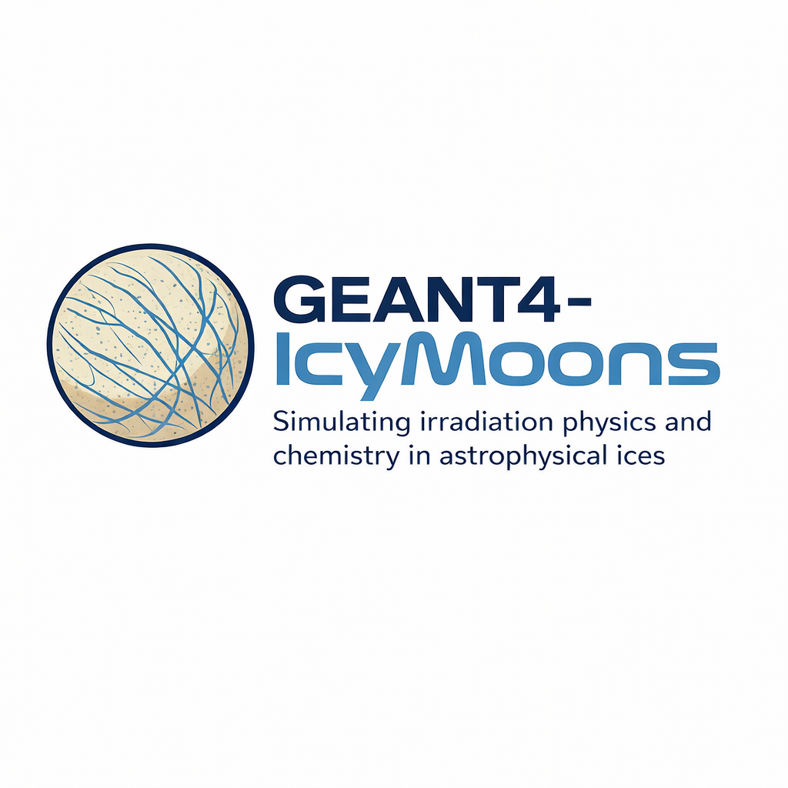

# dnaphysics-ice

<p align="center">
  
</p>

Geant4‑DNA based simulation for electron transport in icy media (water ice). This setup extends the standard Geant4‑DNA physics with Michaud et al. (2003) vibronic/elastic/attachment cross‑sections and associated differential angular data tailored for low‑energy electrons in ice.

The repository includes:

- A Geant4 application under
- Custom DNA data and models provided
- Diagnostic Python scripts for plotting and validating cross‑sections and angular distributions from ROOT outputs.
- Usage examples
- A workflow to study electron interactions in ice on Europa

## Processes

dnaphysics-ice enables low‑energy electron interactions with emphasis on vibrational excitation, elastic scattering, and electron attachment. Process codes follow the standard Geant4‑DNA convention:

- 11: Elastic (e−)
- 12: Electronic excitation (e−)
- 13: Ionisation (e−)
- 14: Attachment (e−)
- 15: Vibrational excitation (e−)

Other DNA processes (e.g., solvation, charge exchange, proton/ion channels) are available through the chosen physics list, but the custom Michaud datasets here target the electron Elastic, VibExc, and Attachment processes.

## Custom cross-sections (g4_custom_ice)

Custom Michaud datasets are provided in `cross_sections`. The relevant DNA data (.dat) are expected under the standard Geant4 data path `G4EMLOW.../dna/`. Names used by the code and diagnostics include:

- Vibrational excitation (total, per channel; differential and cumulated for sampling)
  - `sigma_excitationvib_e_michaud.dat`
  - `sigmadiff_excitationvib_e_michaud.dat`
  - `sigmadiff_cumulated_excitationvib_e_michaud_hp.dat`
- Elastic scattering (Michaud)
  - `sigma_elastic_e_michaud.dat`
  - `sigmadiff_cumulated_elastic_e_michaud_hp.dat`
- Electron attachment (Michaud fit of the “Others” channel in the near‑threshold region)
  - `sigma_attachment_e_michaud.dat`

For convenience and reproducibility, the source tables used to construct the vib/elastic datasets are also kept in this repo under `tabular`:

- `michaud_table2.csv` (intermolecular modes and elastic: v"(T), v'(L), v"(L), Elastic)
- `michaud_table3.csv` (intramolecular modes: v2, v1,3, v3, v1,3+vL, 2(v1,3), Others)

These CSVs drive the Python data generation and plotting utilities.

## Build and run

Prerequisites:

- Geant4 11.x with Geant4‑DNA enabled. Source and header files for the Michaud models are included under `src` and `include` respectivelu.
- CMake ≥ 3.16, a C++17 compiler.

Configure and build:

```
cd <root>/dnaphysics-ice
cmake -S . -B build \
  -DGeant4_DIR=/path/to/g4_install/install/lib/Geant4-11.x
cmake --build build -j
```

Environment variables (recommended):

- `G4LEDATA`: Path to Geant4 low‑energy data (e.g. `/path/to/g4_install/install/share/Geant4/data/G4EMLOW8.6.1`). The diagnostics use `$G4LEDATA/dna/*.dat` to find the reference curves automatically.
- `DNA_ROOT_BASENAME`: Output ROOT basename (default: `dna`).
- `DNA_NTUPLE_FILES`: Number of reduced ntuple files in MT merging mode (default: `0`, single file).  
  Example: `DNA_NTUPLE_FILES=8` writes `dna_m0.root` ... `dna_m7.root` to keep each file smaller.
- `DNA_ROOT_SPLIT_EVENTS`, `DNA_ROOT_MAX_MB`: in-run rotation controls (defaults: disabled / 1024 MB).
  In MT, rotation is safe only when ntuple merging is OFF.
  If you request rotation in MT, the code auto-disables `DNA_NTUPLE_MERGE` so each worker rotates its own file.

The application writes a ROOT file containing a TTree with per‑step variables (kinetic energy, process id, angular cosθ, optional per‑channel cross‑sections, etc.).

## Python diagnostics

Diagnostic scripts live under `python_scripts/` and save figure outputs to `python_scripts/output/`.

- `plotting/plot_diagnostics_all_processes.py`
  - Plots per‑process/per‑channel cross‑sections from `build/dna.root` with optional reference overlays from `.dat` files (Michaud vib/elastic/attachment).
  - Generates deflection‑angle distributions and a compact 4‑panel summary.

- `physics_ice/generate_vibExc_cumulative_dat.py`
  - Rebuilds differential and cumulated vib‑excitation cross‑section tables from `michaud_table2.csv` and `michaud_table3.csv`.
  - Outputs: `sigmadiff_excitationvib_e_michaud.dat`, `sigmadiff_cumulated_excitationvib_e_michaud_hp.dat`.

- `plotting/plot_vibExcitation_channelwise_angular_distributions.py`
  - Visualizes angular PDFs per vib channel using Michaud γ(E) and a Henyey–Greenstein mapping.

Usage example (from `dnaphysics-ice`):

```
python python_scripts/plotting/plot_diagnostics_all_processes.py --root build/dna.root --processes all --out xs_channels.png --summary
```

Notes:

- When `G4LEDATA` is set, the script locates reference `.dat` files in `$G4LEDATA/dna`.
- All outputs are written to `python_scripts/output/`.

## Data generation and modeling notes

- Vibrational channels (8 total) follow:
  - Table 2 (intermolecular): v"(T), v'(L), v"(L)
  - Table 3 (intramolecular): v2, v1,3, v3, v1,3+vL, 2(v1,3)
- Michaud anisotropy γ(E) is converted to an HG parameter via a forward‑hemisphere mapping to build differential angular distributions and sampling CDFs.
- Elastic angular sampling uses the Michaud elastic dataset; attachment uses a Michaud‑based fit of the low‑energy “Others” contribution.

## References

- Michaud et al., “Cross sections for low‑energy electron interactions in water ice” (2003) and related datasets.
- Geant4‑DNA documentation and examples: https://geant4-dna.org

## License

This application integrates with Geant4, distributed under the Geant4 Software License. See the Geant4 license and documentation for further details.
